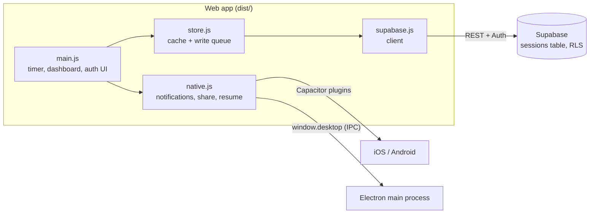

# Architecture

How Pomo Timer is put together. For setup and build commands see the README; for the reasoning
behind these choices see `DECISIONS.md`.

## One web app, five shells

Everything the user sees is a single static web app: `index.html`, `src/*.js`, `src/style.css`,
built by Vite into `dist/`. That folder is then shipped five ways:

| Target | Shell | How `dist/` gets there |
|---|---|---|
| Browser | any modern browser | `pomodoro.py` serves it on `http://localhost:8765` (or `npm run dev`) |
| iOS | Capacitor WebView (`ios/`) | `npx cap sync` copies it into the Xcode project |
| Android | Capacitor WebView (`android/`) | `npx cap sync` copies it into the Gradle project |
| Mac | Electron (`electron/`) | electron-builder packs it into `app.asar` inside the DMG |
| Windows | Electron (`electron/`) | electron-builder packs it into `app.asar` inside the installer |

The app code never branches on "which shell am I in" beyond one boolean:
`Capacitor.isNativePlatform()` (true on iOS/Android). Everything else uses browser APIs with
feature detection, so the desktop app and the browser share the exact same paths, and the desktop
shell adds behaviour only through an optional `window.desktop` object.



## Modules

### `src/main.js` — UI and timer

- **Timer state:** `mode` (`work` / `short` / `long`), `running`, `remaining` (seconds),
  `sessionStart` (ISO, set when a session begins), `plannedMin`, `endTime` (ms epoch).
- **Time is derived, never counted.** Every tick recomputes `remaining` from `endTime - now`.
  A throttled, frozen, or killed JavaScript context therefore cannot make the clock drift; the
  worst case is a late `finish()`, which still logs the correct end time.
- **Persistence:** the whole in-progress state is written to `localStorage["pomo.timer"]` on
  every change and restored on boot (`restoreTimer`). A session that ended while the app was
  closed is detected on the first tick and logged.
- **Lifecycle:** `startTimer` → `syncClock` each second → `finish` (logs a completed session,
  plays/schedules the alert, shows the modal). `pauseTimer` keeps `sessionStart` and cancels the
  alarm. Reset logs a "stopped early" session when at least one minute elapsed.
- **Settings** are per device in `localStorage`: `pomo.categories`, `pomo.category`,
  `pomo.durations`, `pomo.task`. Sessions are the only thing that syncs.
- **Dashboard** is computed from `store.sessions` on every refresh: completed pomodoros today,
  focus minutes today and this week (weeks start Monday), category bars for the week, a by-task
  table, the latest 50 history rows with two-step delete, and the task autocomplete list.
- **Auth UI:** email/password sign-in or sign-up through Supabase Auth; `onAuthStateChange`
  drives which view is visible. Without credentials in the build the setup view shows instead.
- **Resume hooks:** on foreground, `online`, or switching to the dashboard, the app resyncs the
  clock, flushes the write queue, and reloads from Supabase.

### `src/store.js` — sessions, cache, offline queue

- Supabase is the source of truth. A full copy of the user's sessions is cached in
  `localStorage["pomo.sessions"]` so the dashboard renders instantly and works offline.
- Writes are queued in `localStorage["pomo.pending"]` as `{op: "insert", row}` or
  `{op: "delete", id}` and flushed whenever the user is signed in and online. Flushes are
  serialised so two triggers cannot interleave.
- **Error policy:** duplicate-key (`23505`) counts as success; network errors or an expired token
  (`PGRST301`) keep the item queued; any other server rejection drops the item with a console
  warning so one bad row cannot block the queue forever.
- `refresh()` flushes, reloads everything, then overlays still-queued inserts and deletes so the
  UI never flickers back to a stale state.
- `remove()` flushes first; if the row's insert is still queued it is simply dropped locally.
- `importJson()` accepts the legacy `sessions.json` or an Export JSON file, normalises each row,
  skips rows whose `started_at` already exists, and inserts in batches of 200. It needs a
  network connection.
- `normalize()` is the single place that coerces any row shape (Supabase, legacy file, new
  entry) into the app's shape, including mapping the legacy `mode: short|long` to `type: break`.

### `src/native.js` — platform bridge

| Concern | iOS / Android | Browser and desktop app |
|---|---|---|
| Alert at end of timer | `LocalNotifications.schedule` at the exact end time with `alarm.wav`; cancelled on pause/reset | `beep()` via WebAudio + `new Notification()`; on desktop also `window.desktop.timerEnded()` |
| Return to foreground | `App.appStateChange` | `visibilitychange` |
| Export | write to the Cache directory, hand the file to the share sheet | Blob download (Electron shows a save dialog) |
| Status bar | dark style; Android colour and notification channel set on boot | n/a |

### `src/supabase.js` — client

Reads `VITE_SUPABASE_URL` and `VITE_SUPABASE_ANON_KEY` at build time (`import.meta.env`), so
credentials are baked into `dist/`. Exposes `configured` for the setup screen. On iOS/Android the
auth session is stored in Capacitor Preferences rather than WebView `localStorage`, which the OS
may evict. Tokens auto-refresh; URL-based session detection is off (no OAuth redirects).

### `electron/` — desktop shell

- `main.cjs` (main process): creates the window (560×880, min 400×620, dark background),
  Mac menu (App / Edit / View / Window) or no menu on Windows, single-instance lock, hide-on-close
  on Mac, `will-navigate` and `setWindowOpenHandler` guards that push external links to the
  system browser, `backgroundThrottling: false`. `--dev` loads the Vite dev server and opens
  DevTools instead of `dist/index.html`.
- `preload.cjs`: `contextBridge` exposes `window.desktop = { platform, timerEnded(), focus() }`.
  `timerEnded` restores/shows the window without stealing focus and bounces the Dock icon or
  flashes the taskbar; `focus` is used by the notification click handler.
- Security posture: `contextIsolation: true`, `nodeIntegration: false`, `sandbox: true`.
- Identity: `appId` / AppUserModelID `com.rubelefsky.pomotimer`, app name `PomoTimer`. The name
  also picks the profile folder (`~/Library/Application Support/PomoTimer`, `%APPDATA%\PomoTimer`),
  so dev runs and the installed app share sign-in state.

## Data model

One table, `public.sessions` (see `supabase/schema.sql`):

| Column | Type | Notes |
|---|---|---|
| `id` | uuid | generated client-side (so offline rows have stable ids) |
| `user_id` | uuid | defaults to `auth.uid()`, cascades on user delete |
| `started_at`, `ended_at` | timestamptz | ISO strings from the client |
| `task`, `category` | text | empty for breaks |
| `type` | text | `work` or `break` |
| `planned_min`, `actual_min` | numeric(6,1) | `actual_min` is rounded to 0.1 |
| `completed` | boolean | false when stopped early |
| `created_at` | timestamptz | server default |

Row-level security has four policies (select / insert / update / delete), each requiring
`auth.uid() = user_id`. The anon key is therefore safe to ship: without a signed-in user's JWT it
can read nothing. Index: `(user_id, started_at desc)`.

The dashboard treats a row as "today" or "this week" by its `ended_at`, and counts a pomodoro
only when `type = work` and `completed = true`.

## Build pipeline

```
.env  ─┐
       ├─ vite build ──► dist/ ──┬─ npx cap sync ──► ios/App/App/public, android/.../assets/public
src/  ─┘                         └─ electron-builder ──► release/*.dmg, release/*.exe
```

- `vite.config.js` sets `base: "./"` so the same build works from `file://` (Electron),
  `capacitor://localhost` (iOS), `http://localhost` (Android, browser).
- `capacitor.config.json`: `appId com.rubelefsky.pomotimer`, `appName PomoTimer`, `webDir dist`,
  dark `backgroundColor`, notification presentation options.
- Native projects are committed. Android: `minSdk 24`, `targetSdk 36`, permissions `INTERNET`
  and `USE_EXACT_ALARM`. iOS: deployment target 15.0, dependencies via Swift Package Manager.
- `electron-builder.yml`: only `dist/`, `electron/main.cjs`, `electron/preload.cjs` and
  `package.json` go into `app.asar` (the renderer is fully bundled, so no `node_modules`).
  Targets: DMG for arm64 and x64, NSIS installer for x64. Output `release/` is gitignored.
- Versions: `package.json` `version` names the desktop artifacts and the Mac About box. iOS and
  Android carry their own version numbers inside the native projects.

## Local storage keys

| Key | Holds |
|---|---|
| `pomo.timer` | in-progress timer state |
| `pomo.sessions` | cached copy of all sessions |
| `pomo.pending` | queued inserts/deletes |
| `pomo.categories`, `pomo.category` | category list and current category |
| `pomo.durations` | focus / short / long minutes |
| `pomo.task` | current task text |
| `sb-<project-ref>-auth-token` | Supabase session (browser and desktop; Capacitor Preferences on phones) |

Signing out clears the sessions cache and the queue (with a warning if anything is unsynced) but
keeps the per-device settings.
